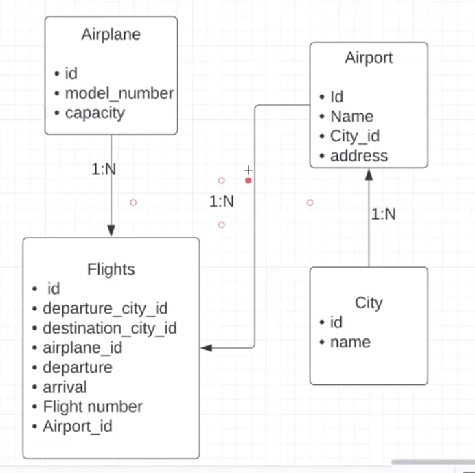

# Welcome to the Flight Service

## Project Setup
- Clone the project on your local.
- Execute `npm install` on the same path as of your root directory of the downloaded project.
- Create a `.env` file in the root directory and add the following environment variable.
    - `Port=3000`
    - `npx sequelize db:migrate`
    - `npx sequelize-cli db:seed:all` to seed all the data

# Whimsical, LucidChart for Database Design
## DB Desighn
    - Airplane Table
    - Flight
    - Airport
    - City

    - A flight belong to an airplane but one airplane can be used in multiple filghts.
    - A city has has many airports but one airport belong to only to one city.
    - One airport can have many flights, but a flight belongs to one airport.

## Tables

### City -> id, name, created_at, updated_at
### Airpoty ->  id, name, adress, city_id, created_at, updated_at
    Relationship -> City has many airports and Airport belong to a city (one to many)